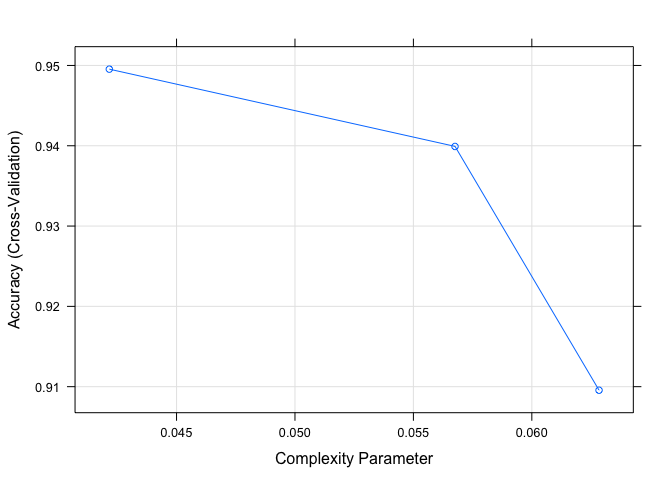

## Loading Libraries

```r
library(rpart)				        # Popular decision tree algorithm
library(rpart.plot)			    	# Enhanced tree plots
library(RColorBrewer)			  	# Color selection for fancy tree plot
library(party)					      # Alternative decision tree algorithm
library(partykit)				      # Convert rpart object to BinaryTree
library(caret)					      # Just a data source for this script
library(e1071)
library(tree)
library(data.table)
library(ggplot2)
library(gridExtra)
```


## Loading Yelp Dataselt
Dataset can be found here see <https://www.kaggle.com/yelp-dataset/yelp-dataset/data>.

```r
# load
training.x<-read.csv("training.x.csv")
training.x<-training.x[,-19]
training.y<-read.csv("training.y.csv")
testing.x<-read.csv("testing.x.csv")
testing.x<- testing.x[,-19]
testing.y<- read.csv("testing.y.csv")
```

## Cleaning The Dataset

```r
cnvrt.factor <- c(2:16)
training.x<-subset(training.x, select = -c(X))
training.x[,cnvrt.factor]<- lapply(training.x[,cnvrt.factor], factor)
training.y<-subset(training.y, select = -c(X))
training.y<- as.factor(training.y$x)
testing.x<-subset(testing.x, select = -c(X))
testing.x[,cnvrt.factor]<- lapply(testing.x[,cnvrt.factor] , factor)
testing.y<-subset(testing.y, select = -c(X))
testing.y<- as.factor(testing.y$x)
```

## Model Tuning
Traing a Classfication Tree Model having the with 10 fold cross validation method


```r
train_control<- trainControl(method="cv", number=10)


clasmodel<- train(x=training.x, y=training.y, trControl=train_control, method="rpart")
clasmodel
```

```
## CART 
## 
## 17558 samples
##    17 predictor
##     2 classes: 'Bad', 'Good' 
## 
## No pre-processing
## Resampling: Cross-Validated (10 fold) 
## Summary of sample sizes: 15802, 15802, 15803, 15802, 15802, 15803, ... 
## Resampling results across tuning parameters:
## 
##   cp          Accuracy   Kappa    
##   0.04216216  0.9483990  0.7040519
##   0.05675676  0.9396291  0.6278712
##   0.06283784  0.9151978  0.2915288
## 
## Accuracy was used to select the optimal model using the largest value.
## The final value used for the model was cp = 0.04216216.
```

```r
plot(clasmodel)
```

<!-- -->


# Model Validation


```r
tree.pred<- predict(clasmodel, testing.x)
testResultsTREE <- data.frame(obs = testing.y, pred = tree.pred)
tree.summary<-defaultSummary(testResultsTREE)
cm.tree2<-confusionMatrix(tree.pred,testing.y, positive = "Good")
cm.tree2
```

```
## Confusion Matrix and Statistics
## 
##           Reference
## Prediction  Bad Good
##       Bad   350   82
##       Good  159 3799
##                                           
##                Accuracy : 0.9451          
##                  95% CI : (0.9379, 0.9517)
##     No Information Rate : 0.8841          
##     P-Value [Acc > NIR] : < 2.2e-16       
##                                           
##                   Kappa : 0.7134          
##  Mcnemar's Test P-Value : 9.801e-07       
##                                           
##             Sensitivity : 0.9789          
##             Specificity : 0.6876          
##          Pos Pred Value : 0.9598          
##          Neg Pred Value : 0.8102          
##              Prevalence : 0.8841          
##          Detection Rate : 0.8654          
##    Detection Prevalence : 0.9016          
##       Balanced Accuracy : 0.8332          
##                                           
##        'Positive' Class : Good            
## 
```

```r
# ROC

# convert good to 1, bad to 0
goodbad<- function(x){
        if (x=="Good"){
                return(1)
        }
        else{
                return(0)
        }
}
test.converted<-sapply(testResultsTREE$obs,goodbad) 
pred.converted<-sapply(testResultsTREE$pred,goodbad)

library(ROCR)
```

```
## Loading required package: gplots
```

```
## 
## Attaching package: 'gplots'
```

```
## The following object is masked from 'package:stats':
## 
##     lowess
```

```r
tree_scores <- prediction(pred.converted, test.converted)

#ROC Curve
tree_perf <- performance(tree_scores, "tpr", "fpr")

plot(tree_perf,
     main="classification tree ROC Curves",
     xlab="1 - Specificity: False Positive Rate",
     ylab="Sensitivity: True Positive Rate",
     col="darkblue",  lwd = 3)
abline(0,1, lty = 300, col = "green",  lwd = 3)
grid(col="aquamarine")
```

<!-- -->

```r
# AUC
tree_auc <- performance(tree_scores, "auc")
tree_auc2<- as.numeric(tree_auc@y.values)
tree_auc2 # Area Under the Curve
```

```
## [1] 0.8332471
```

